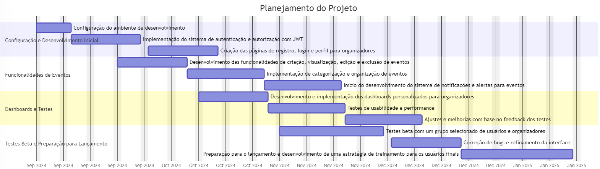
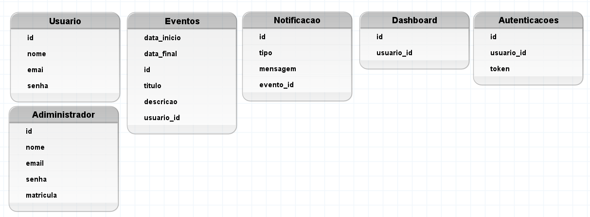
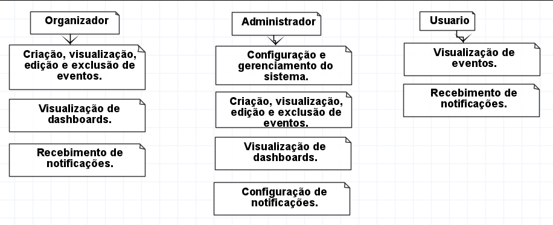
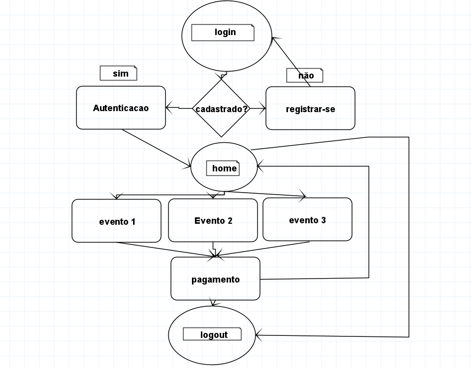
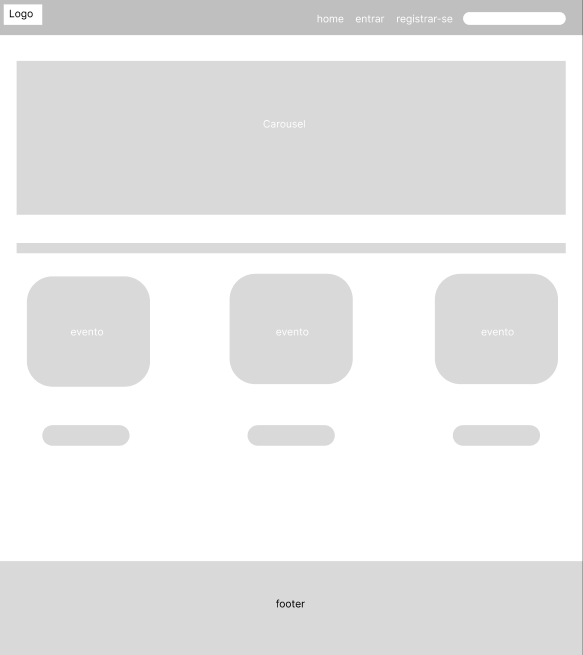
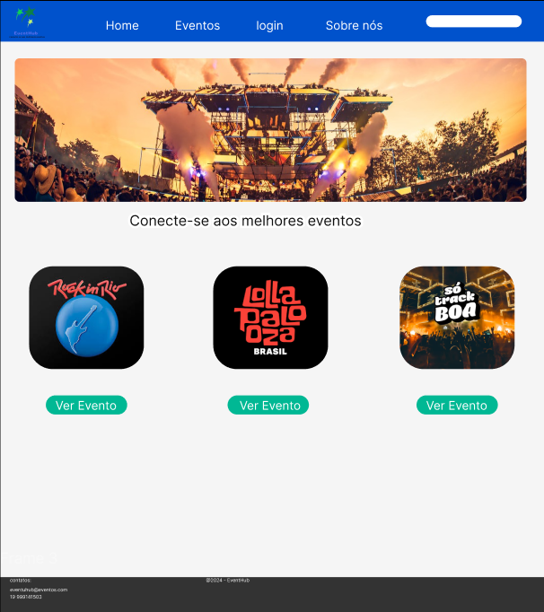

# **Plataforma de Criação e Gerenciamento de Eventos**

O Projeto de Criação e Gerenciamento de Eventos visa desenvolver uma plataforma web moderna e intuitiva para facilitar a organização e gestão de eventos. Utilizando React no front-end, Node.js no back-end e MongoDB como banco de dados, a plataforma oferecerá funcionalidades completas para criação, visualização e gerenciamento de eventos. Focada em segurança e desempenho, nossa solução proporcionará uma experiência fluida e escalável para organizadores e participantes.

## **Objetivos**
### **Específicos:**

•	Desenvolver um sistema de autenticação e autorização seguro para garantir que apenas usuários autorizados possam acessar e gerenciar os eventos.

•	Para os administradores implementar funcionalidades para criação, visualização, edição e exclusão de eventos, além de categorizá-los e organizar em diferentes tipos (ex: conferências, workshops, webinars).

•	Criar uma interface de usuário intuitiva com dashboards para que os organizadores possam acompanhar a gestão dos eventos e a participação dos usuários.

•	Garantir a segurança e integridade dos dados dos eventos e dos usuários através da implementação de práticas robustas de segurança.

### **Mensuráveis:**

•	Implementação da aplicação web com cobertura de testes unitários de pelo menos 85%.

•	Tempo de resposta para operações de CRUD de eventos deve ser inferior a 1 segundo.

•	Taxa de satisfação dos usuários deve ser superior a 90% em testes de usabilidade.

•	Suporte a até 500 eventos simultâneos e 1000 usuários simultâneos sem degradação significativa de desempenho.

### **Atingíveis:**

•	Utilizar frameworks e bibliotecas amplamente adotados (React, Node.js, MongoDB) para garantir a qualidade e entrega pontual do projeto.

•	Definir entregas em ciclos ágeis (sprints), com revisões e feedback contínuos para ajustar o desenvolvimento conforme necessário.

•	Formar uma equipe de desenvolvimento com experiência nas tecnologias escolhidas e conhecimento no gerenciamento de eventos.

### **Relevantes:**

•	Atender à necessidade de uma plataforma eficiente para gerenciamento de eventos, facilitando a organização e acompanhamento dos mesmos.

•	Proporcionar uma solução escalável que possa ser adaptada para diferentes tipos e tamanhos de eventos e possa integrar com outras ferramentas no futuro.

•	Facilitar a gestão e a comunicação com os participantes, contribuindo para eventos bem-sucedidos e bem-organizados.

### **Temporais:**

•	Concluir o desenvolvimento da aplicação em 4 meses, com entregas iterativas a cada 3 semanas.

•	Implementar e testar o módulo de autenticação e autorização até o final do primeiro mês.

•	Finalizar as funcionalidades básicas de gerenciamento de eventos até o final do segundo mês.

•	Implementar a interface de usuário e dashboards no terceiro mês.

•	Realizar testes beta e ajustes finais nos dois últimos meses do cronograma.

## **Cronograma**
### **Planejamento**

<!-- Caminho para a imagem do cronograma -->

### **Semana 1-3:**
•	Configuração do ambiente de desenvolvimento.

•	Implementação do sistema de autenticação e autorização com JWT.

•	Criação das páginas de registro, login e perfil para organizadores.

### **Semana 4-6:**

•	Desenvolvimento das funcionalidades de criação, visualização, edição e exclusão de eventos.

•	Implementação de categorização e organização de eventos.

•	Início do desenvolvimento do sistema de notificações e alertas para eventos.

### **Semana 7-9:**

•	Desenvolvimento e implementação dos dashboards personalizados para organizadores.

•	Testes de usabilidade e performance.

•	Ajustes e melhorias com base no feedback dos testes.

### **Semana 10-15:**

•	Testes beta com um grupo selecionado de usuários e organizadores.

•	Correção de bugs e refinamento da interface.

•	Preparação para o lançamento e desenvolvimento de uma estratégia de treinamento para os usuários finais.

**Recursos**
### **Equipe:**

•	1 Gerente de Projetos

•	2 Desenvolvedores Full-Stack (React e Node.js)

•	1 Designer UI/UX

•	1 Especialista em Testes e QA

•	1 Analista de Suporte Técnico para treinamento dos usuários

### **Tecnologias:**

•	React (Front-end)

•	Node.js (Backend)

•	MongoDB (Banco de Dados)

•	JWT (Autenticação e Autorização)

•	Docker (Containerização)

•	Git/GitHub (Controle de Versão)

### **Ferramentas de Gestão:**

•	Jira/Trello para gerenciamento de tarefas

•	Teams para comunicação interna

•	Figma para design de interfaces

## **Análise de Riscos**

•	Atrasos no cronograma devido a requisitos não previstos.

o	Mitigação: Realizar reuniões regulares com stakeholders para garantir alinhamento das expectativas e ajustes de escopo.

•	Problemas de segurança que comprometam dados dos usuários.

o	Mitigação: Implementar práticas robustas de segurança desde o início e realizar auditorias de segurança regularmente.

•	Desempenho insatisfatório da aplicação com alta carga de usuários.

o	Mitigação: Implementar testes de carga e otimizar a aplicação para suportar altas demandas.
•	Falta de adesão dos usuários após o lançamento.

o	Mitigação: Desenvolver e executar uma estratégia de treinamento e suporte para garantir que os usuários estejam confortáveis e confiantes ao usar a nova ferramenta.

## **Diagramas**
### **classe**

### **Uso**

### **Fluxo**

## **Prototipagem**
### **baixa**

### **Media**

### **alta**

